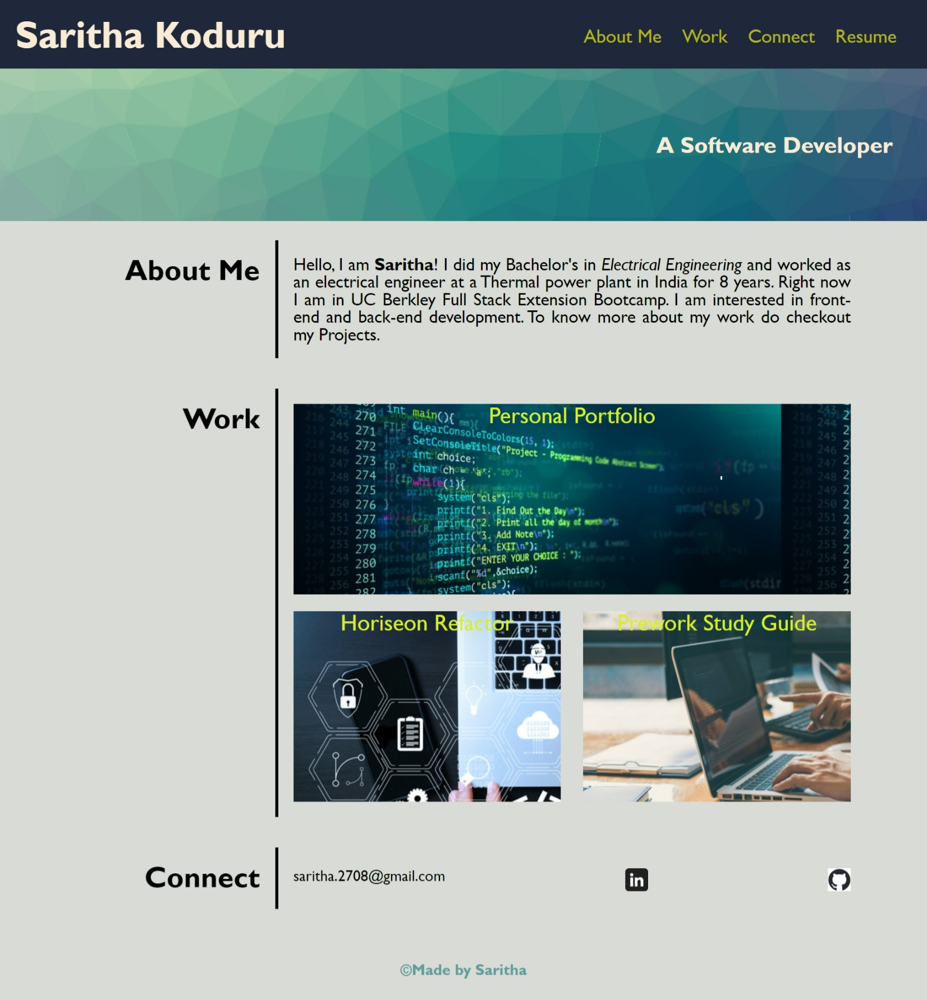

# Saritha Koduru's Portfolio

## Description

This application shows Saritha Koduru's personal portfolio where you get to know about
her technical experience, domain expertise and the projects she worked on.

## Usage

When you click on each one of the links provided in the navigation then the page scrolls to the corresponding section. 
The content includes the sections About me, Work and Connect. When you click on each individual project, it takes you to the 
deployed application. You can also access her Linkedin and Github profile by clicking on respective icons in the connect section. 

## Credits

Background image for the sub-title is from https://coolbackgrounds.io/  and the background images for the projects are from 
https://www.vecteezy.com/.

The LinkedIn logo is registered trademark of LinkedIn Corporation and its affiliates in the United States and/or other countries.

Github logo is from https://github.com/logos.

## License

MIT License

## Project URL

URL link to the Saritha's Portfolio webpage:
(https://saritha2708.github.io/personal-portfolio/).

## Project image

The following image shows the display of the webpage:

